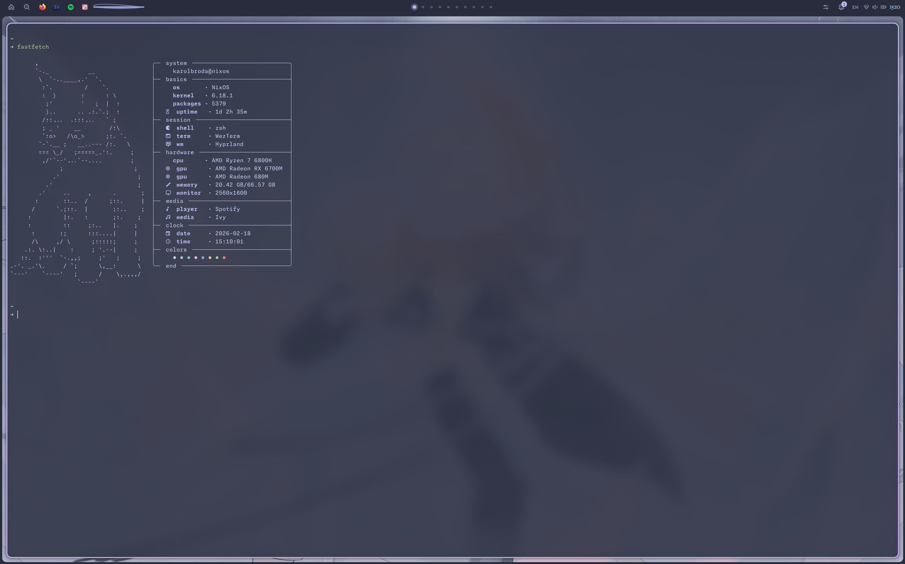

<h1 align="center">
  
  nix-config
</h1>

<p align="center">
  <i>my personal nix configuration for nixos and macos</i>
</p>

<p align="center">
  <code>nixos 25.11</code> · <code>flake-parts</code> · <code>catppuccin frappe lavender</code>
</p>

<br/>

<p align="center">
  
</p>

<details>
<summary>more screenshots</summary>
<br/>
<p align="center">
  
</p>
<p align="center">
  
</p>
<p align="center">
  
  
</p>
</details>

<br/>

## overview

everything is managed declaratively through a single flake. the whole thing is built on [flake-parts](https://github.com/hercules-ci/flake-parts) so every output (hosts, packages, dev shells, checks, etc.) lives in its own file under `parts/`

system features are option-gated modules under `modules/`, so toggling something like audio, bluetooth, or steam is just `personal.hardware.audio.enable = true`. shared home-manager programs live in `home/karolbroda/programs/shared/` and get imported by both platforms automatically

the desktop shell (bar, dashboard, lockscreen, launcher) is a custom [quickshell](https://git.outfoxxed.me/outfoxxed/quickshell) config written in QML

## stack

| | nixos | macos |
|---|---|---|
| wm / compositor | hyprland | aerospace |
| shell | quickshell | sketchybar |
| terminal | wezterm | wezterm |
| editor | neovim (nixvim) | neovim (nixvim) |
| browser | firefox | firefox |
| theme | catppuccin frappe lavender | catppuccin frappe lavender |

## usage

### nixos

```bash
sudo nixos-rebuild switch --flake .#nixos
```

### macos

fresh install with the [determinate systems installer](https://install.determinate.systems):

```bash
curl --proto '=https' --tlsv1.2 -sSf -L https://install.determinate.systems/nix | sh -s -- install
```

```bash
git clone https://github.com/karol-broda/nix-config.git ~/nix-config
cd ~/nix-config
sudo nix run nix-darwin -- switch --flake .#macbook
```

after that:

```bash
sudo darwin-rebuild switch --flake .#macbook
```

### update inputs

```bash
nix flake update
```
