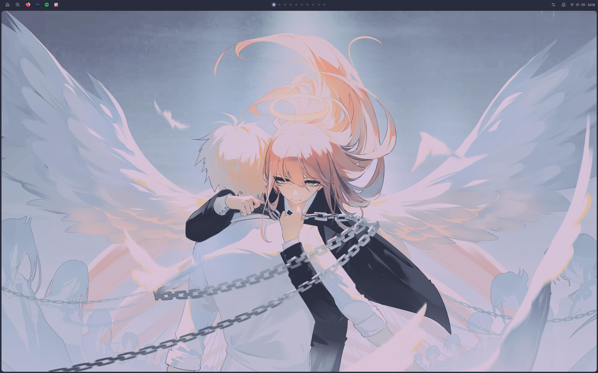
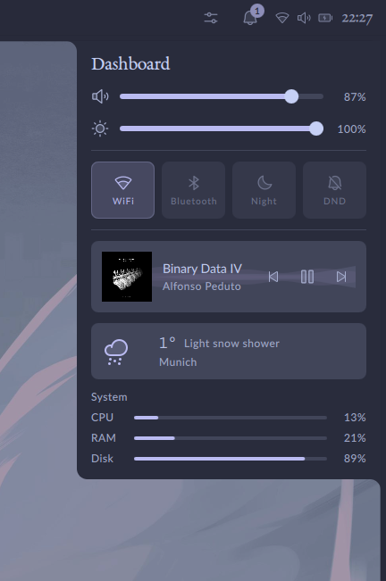
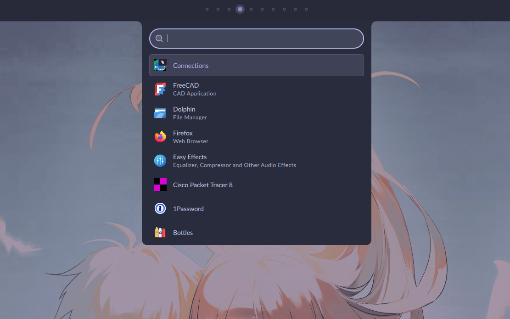
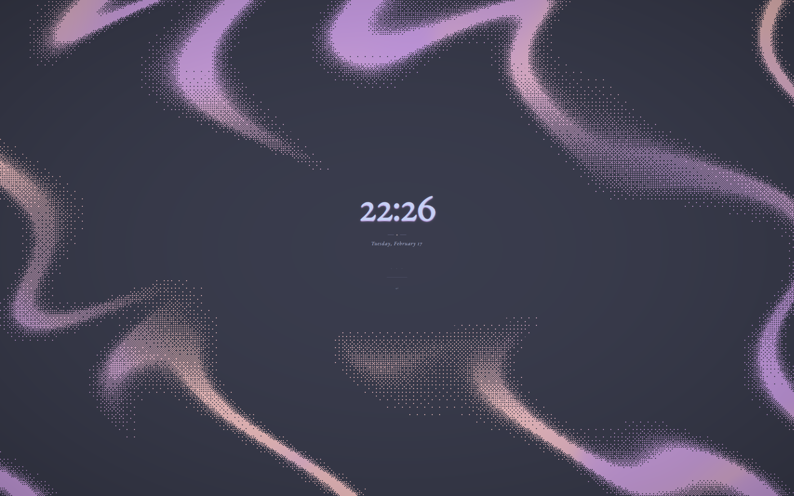

# quickshell

my personal quickshell configuration for hyprland. catppuccin frappe theme

---

## screenshots

<table>
  <tr>
    <td align="center">
      
       <b>shell</b>
    </td>
    <td align="center">
      
       <b>dashboard</b>
    </td>
  </tr>
  <tr>
    <td align="center">
      
       <b>launcher</b>
    </td>
    <td align="center">
      
       <b>lockscreen</b>
    </td>
  </tr>
</table>

---

## built with

- [quickshell](https://quickshell.outfoxxed.me) for the shell
- [hyprland](https://hyprland.org) as the window manager
- [catppuccin frappe](https://github.com/catppuccin/catppuccin) for colors
- [elephant](https://github.com/abenz1267/elephant) for the launcher

---

## features

- bar with workspaces, systray, clock, and power menu
- dashboard with media, system resources, calendar, weather
- app launcher with wallpaper picker
- lock screen with media controls
- popup notifications
- control center for audio, network, bluetooth

---

## customization

everything is in qml files:

- colors in `services/Colours.qml`
- fonts and general settings in `config/Config.qml`
- component layouts throughout the modules

but honestly this is a config just for me so i wont really support issues that other people have, but that may change

---

## ideas i guess

[] maybe something like a polkit agent, would need to write a bridge process for that tho

---

## credits

i learned most of what i know about quickshell and qml from studying [caelestia shell](https://github.com/caelestia-dots/shell). huge thanks to the authors for making such a well-structured codebase.
originally i read them and tried to recreate it myself, then i refactored it and restructured the shell a bit. now i rewrote everything from scratch with everything i learned